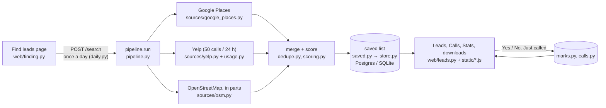

# Lead Finder: developer overview

How the code fits together, how to run it, and how it is tested. See also the
[sales guide](sales-guide.md) (what each page does) and the
[operator runbook](operator-runbook.md) (switches, deploys, alerts, database).

## How a search flows



In words: the Find leads page claims the day's search (`daily.py`) and runs
`pipeline.run` in a background thread. The pipeline asks each source (Google,
Yelp within its 24-hour budget, and the free map data in parts), keeps what is
within the radius, merges duplicates (`dedupe.py`), scores each business
(`scoring.py`, rules in `config.py`) and `saved.save_search` merges the result
into the one saved list, one row per business. The Leads, Calls and Stats pages
read the saved list (`/leads`, filtered, sorted and paged by the server) with the
marks and calls added; Yes / No and Just called write to their own tables and
never touch the saved row. Problems go to `alerts.py`.

## The search, step by step

1. **Geocode** the location (built-in table for SLC-area cities, then ZIP lookup, Google, or OpenStreetMap Nominatim).
2. **Search**: Google Places text search for your keywords, the competitor names, then ~27 business-type phrases, across 1/7/19 grid cells; Yelp's 13 category searches (most-reviewed first), then word searches for your keywords and the competitor names; and OpenStreetMap Overpass queries for matching tags and name words, one per area of up to 20 miles (several mirror servers are tried; a failed area is asked again in quarters; four minutes in all).
3. **Filter** to the exact radius (Haversine distance).
4. **Dedupe**: listings within ~200 m with matching names (or the same phone) are merged, keeping Google's (then Yelp's) contact details and OpenStreetMap's building size. Different phone numbers or names that only share generic words ("Inn & Suites Airport") are kept apart. Then the parts of one named site become one lead (`merge_sites`): listings with the same *site name* (the cleaned name without building numbers or letters and words like "campus", "center", "building": "Shoreline Ridge 825" → "shoreline ridge"), each within 0.2 mi of the next and the whole site at most 0.5 mi across (`SITE_MILES`), with no phone numbers that differ. Names that are only numbers and generic words ("343 Apartments", "Building 2") never merge this way. The lead is named after the site ("Shoreline Ridge"), keeps every listing (the building names go into its other names) and the largest footprint. The saved list uses the same rule (`saved.py`): a later search's building joins the saved site. Rows already saved as separate leads are merged only on request with `python -m leadgen merge-sites` (calls and Yes / No clicks move to the row saved first, the latest mark wins, the merged rows stay hidden and are recorded in `merged_leads`); searches never do this on their own. Places Google or Yelp report permanently closed are then left out of the search's results and are never added to the saved list; a business already saved that is among them is flagged "Closed for good" there (it keeps its mark and calls).
5. **Score**, sort by score then distance, and **export**.

API responses are cached for 7 days (Yelp searches in the database), so
re-running the same search is instant and doesn't re-bill.

## Tests and checks

```bash
pip install -r requirements-dev.txt
python -m playwright install chromium          # for the browser tests
python -m pytest                               # SQLite
LEADGEN_TEST_DATABASE_URL=postgresql://... python -m pytest   # a throwaway Postgres
python -m ruff check .                         # lint and layout (settings in pyproject.toml)
python -m vulture                              # dead code (settings in pyproject.toml)
python -m mypy                                 # strict type check (settings in pyproject.toml)
```

The code: `leadgen/pipeline.py` runs a search (sources in `leadgen/sources/`);
`leadgen/saved.py`, `marks.py`, `calls.py` and `daily.py` keep the saved data
(`store.py` is the database); `alerts.py` records problems and sends them to the
webhook. The website is `leadgen/web/`: `auth.py` (login),
`finding.py` (Find leads), `leads.py` (the saved list, marks, calls, stats,
downloads) and `common.py`. `export.py` lays out the CSV and Excel files and
`xlsx.py` writes the Excel format; `reference.py` copies the site's marks into
the scoring tests. The page's markup is `leadgen/templates/index.html`;
its script and styles are in `leadgen/static/` (`core.js` first, then one file
per page, then `start.js`). Spacing, radii and text sizes come from one scale of
CSS variables in `templates/_theme.html` (`--sp-1` … `--sp-6`, `--fs-xs` …
`--fs-xl`); use those rather than raw pixel values. Reading text is at least
14 px (`--fs-sm`); only badges and counts use `--fs-xs` (12 px).

The tests never call Google, Yelp or OpenStreetMap (they are mocked), and
`tests/conftest.py` makes sure of it: for the whole run, connections to
anything but this machine fail, and the cache folder (with the SQLite database)
is a temporary one, so even a search thread that outlives its test can't reach
the internet or write into the folder pytest was started from. A test that
starts a search waits for it to finish.
`tests/test_browser.py` drives the real pages in Chromium (mark Yes, a
double-click marks one business only, Undo, Just called and its kept draft, the
Calls page opening on the latest call and keeping earlier notes in view,
competitors not asked Yes / No, the search confirmation, a refused search saying
why (in the browser and from the server), the phone cards and the short phone
header, Stats, downloads and their busy state, reload keeps the
view, the colour switch fitting from 320 px up, 44 px touch targets on a
phone, the Calls cards and every page link in view at 320 px, a closed business
keeping its mark, the skip link and the short Recent changes); it is skipped when Playwright's Chromium is missing.
`tests/test_closed_and_alerts.py` covers closed businesses in every view, the
downloads and Stats, an incomplete search giving the day back, and problem
reports (the webhook is mocked).
Tests are named for the feature they protect: `tests/test_map_data.py` covers the
map data asked in parts (every query bigger than one part fails, a failed part is
asked again in quarters, areas busy servers missed are asked again automatically and
the search ends complete, a part that never answers leaves the search incomplete
with the other parts' businesses saved, the catch-up rounds' time limit);
`tests/test_saved_list.py` closed businesses never being added, refreshes after a
big search staying one page at most and the parsed saved list being reused;
`tests/test_calls.py` calls on unmarked businesses and who made each mark and call;
`tests/test_daily_search.py` the one re-run after an incomplete search;
`tests/test_find_page.py`, `tests/test_search_words.py`, `tests/test_campus.py`,
`tests/test_downloads.py`, `tests/test_switches.py` and `tests/test_offline.py`
what their names say. The browser tests also log a call on Not
checked, double-click Start search (nothing gets selected), and check "No street
address" and the tier words at desktop and 390 px.
`tests/test_cli.py` runs the command line with the sources mocked.

The layout is checked rather than reformatted: ruff's formatter would undo the
aligned continuation lines, so `pyproject.toml` turns on pycodestyle's layout
rules (indentation, whitespace, blank lines, lines of at most 120 characters)
and the lint fails on a badly laid-out file.

GitHub Actions (`.github/workflows/ci.yml`) runs the lint, the dead-code and
strict type checks and every test, on SQLite and on Postgres, for each push and
pull request; Render deploys only commits that pass, and branch protection on
`main` should require the three jobs (see "Deploying" in the [operator runbook](operator-runbook.md#deploying)). Every public function in
`leadgen/` has parameter and return annotations (`strict = true` for mypy).

## Command line options

```bash
python -m leadgen run --location 84101 --radius 30 --keywords compactor baler recycling --out leads.xlsx
python -m leadgen run --location "Ogden, UT" --radius 15 --out ogden.csv
python -m leadgen run --source google --grid 7                        # wider Google coverage
python -m leadgen run --source yelp --max-requests 20                 # Yelp only, 20 calls
python -m leadgen run --grid 7 --max-requests 300                     # wider, but capped spend
python -m leadgen run --min-score 40 --limit 200                      # only strong leads
python -m leadgen reference       # copy the site's Yes / No marks into the scoring tests
```

Yelp is only used on the command line when `DATABASE_URL` points at the
website's database, so its calls count against the site's one limit of 50 a
day (see the Yelp notes in the [operator runbook](operator-runbook.md#yelp-notes)). Without it, `--source yelp` stops with an
explanation, and `--source auto` leaves Yelp out and says so.

| Option | Default | What it does |
| --- | --- | --- |
| `--location` | Arco Compactor (876 Fortune Rd, Salt Lake City) | ZIP, city, address, or `lat,lon`. The radius and the Miles column are measured from here |
| `--radius` | 30 | Miles from the center; results outside are removed |
| `--keywords` | compactor baler waste recycling | Extra search terms (they add businesses to look for; scores always use the defaults) |
| `--source` | auto | `auto` = OpenStreetMap plus Google and/or Yelp when their key is set. Also `google`, `yelp`, `osm`, and `both` (Google + OpenStreetMap) |
| `--min-score` | 20 | Drop leads below this score (competitors are always kept) |
| `--grid` | 1 | Google and Yelp. 1, 7 or 19 search cells. Google caps each search at 60 results and Yelp at 240, so more cells find more businesses (and cost more). Yelp searches at most 25 miles around a point, so past 25 miles it needs 7 cells; at the default 1 it searches the 25 miles around the center instead when 7 would take more calls than are left |
| `--max-requests` | auto | Hard cap on API calls per run, for Google and for Yelp separately. Auto = Google: enough for every search (about 100 at `--grid 1`); Yelp: 50. Yelp never goes past its daily limit of 50 calls, whatever the cap. Under a cap, every search gets its first page before any gets a second; Google searches your keywords and the competitor names first, Yelp its category searches |
| `--only-keyword-matches` | off | Keep only leads matching a keyword |
| `--limit` | 0 (all) | Keep the top N prospects (competitors are always kept) |
| `--out` | output/leads.xlsx | `.xlsx` or `.csv` |
| `--api-key`, `--yelp-api-key` | from `.env` | Instead of `GOOGLE_PLACES_API_KEY` / `YELP_API_KEY` |

## Tuning after vetting

Everything adjustable is in `leadgen/config.py`:
- `CATEGORIES`: business types, their weights, and the Google types / Yelp categories / OSM tags / name words that identify them.
- `HIGH_VOLUME_BRANDS`: chains that almost always have a baler or compactor.
- `GOOGLE_QUERIES`: the search phrases sent to Google.
- `YELP_SEARCHES`: the Yelp category searches, `YELP_DAILY_LIMIT` (50) and `YELP_DEFAULT_MAX_REQUESTS`.
- `REVIEW_BONUS`: review-count thresholds for Google and Yelp.
- `COMPETITORS`: names and website fragments to flag.

## Limits and next steps

- OpenStreetMap coverage of businesses is uneven and often lacks phones; Google is recommended for production runs, and Yelp helps for stores, hotels and hospitals.
- The score estimates likelihood; it cannot see whether a compactor is actually on site. That's what vetting is for.
- Ideas from the spec for later: website text scanning / AI classification, USPS address validation, enrichment (employees, NAICS), scheduled weekly runs with email, CRM export.

## How the pages behave (details)

The [sales guide](sales-guide.md) is the short, task-based version for staff; this is
the full behaviour, for whoever changes or supports the site.

The sidebar has four pages, a Light / Dark / System colour switch (System
follows the computer's setting; the choice is remembered in each browser), and
every page carries the Wright AI Solutions copyright. The browser tab names the
page ("Leads · Arco Compactor Lead Finder") and shows the Lead Finder icon.
On phones and tablets every button and link is at least 44 px each way (on a
narrow window the "Only businesses matching the search words" tick box too). On a
phone the navigation is one short bar at the top (the page counts show just the
number; on the narrowest phones the links wrap to a second line, so Stats is
never cut off), with the Yelp count, the colour switch and Log out under **Menu**; the
browser's own bar takes the sidebar's colour, light or dark. Times are written
one way everywhere, in Utah time: "Sep 29, 2026, 4:43 PM", or "4:43 PM".
The first Tab stop on every page is **Skip to main content**, which jumps past
the sidebar to the page's list (Leads, Calls) or heading.

- **Find leads**: the search form (extra settings, each explained in plain
  words, under **More options**), a step-by-step progress bar while it runs,
  and the search history with each search's counts under **Details**, in plain
  words and in funnel order so the numbers add up: businesses found per source,
  listings within the radius, duplicates merged, businesses after merging, then
  what was left out (closed for good, a score below the minimum, e.g. "Left out:
  score below 20", not matching the search words, over a lead limit), leads kept,
  competitors among them, the leads per tier A to D, then the paid lookups and how
  long it took. The form checks itself before anything runs: **Search around** must
  not be empty (it is never quietly replaced by Arco's address), and the search
  words are limited to 20, each up to 60 characters (the hint says so). When
  a search can't start, whether the browser catches it or the server refuses
  (a bad value, today's search already run, searching paused, the database
  down), the reason shows in red under **Find leads** and next to the field it is
  about, and stays until the form is edited. The note beside the button (how the
  day stands, e.g. "Today's search ran at 4:43 PM") is plain grey text.
  When a search finishes, the page gets only the counts it shows ("N new leads,
  M saved leads in all"), not the saved list, so finishing stays quick however
  long the list grows. **Find Leads works once per calendar day** (Utah time), for the whole site:
  after today's search it is off until midnight. Pressing **Find leads** first
  shows a summary (location, miles, search words, sources) and says this uses
  today's only search: **Start search** runs it, **Go back and edit** (or Escape)
  leaves the day unused. A search that fails outright
  (e.g. an unknown location, or the map data service is down) gives the day
  back, says so in one or two plain sentences (with one piece of advice: "You
  can try again now; if it fails again, try later today"), and stays in the history marked
  **Failed** with the reason; so does one that never finished (the server
  restarted), after 30 minutes (the page says when, in Utah time). A search
  where one source failed while the others worked (say Google refused its key,
  or the map data service was down) is **incomplete**: the businesses the other
  sources found are saved, but the day is given back, so the search can be run
  again once that source works. The page says which source is missing and that
  today's search was not used up (for Google or Yelp: "ask whoever looks after
  the site to check the key"), and the history shows the search's lead count
  marked **Incomplete**, with the reason. An incomplete search can be re-run
  **once** that day (`INCOMPLETE_RERUNS` in `leadgen/daily.py`; an exception to the
  owner's once-a-day rule that the developer added, awaiting the owner's
  confirmation: set it to 0 to remove it); the note beside
  the button says "1 re-run left today". If the re-run is incomplete too, what
  it found is saved and it uses up the day like a complete search, so a key that
  stays broken can't turn the day into unlimited searches (each spending Yelp
  calls); a third search that day is refused with "the next search can run
  tomorrow, from midnight Utah time". A source switched off by the
  administrator is not a failure (the day is used as usual). At the bottom of the
  page, **For the site administrator** (a quiet section, closed until opened)
  holds **Recent problems** (failed or incomplete searches and server errors of the
  last 7 days) and the **site switches**; each switch asks first, naming its effect
  ("Pause all searching for everyone? ..."), and Cancel leaves it as it was. The problems list is there so nobody has to read the logs to
  notice them (see "Problems: the webhook" in the [operator runbook](operator-runbook.md)). The public map servers often
  refuse or time out on one big query, so a wide search asks the free map data
  **in parts**: a grid of areas up to 20 miles wide (`OVERPASS_PART_MILES`; a
  30-mile search is 9 areas), two at a time, each starting at a different map
  server (the progress text says "3 of 9 areas done"; the count only moves forward, and when areas are asked again in smaller parts the total grows with a short note saying so). An area no server answers is
  asked again as four smaller ones; if one still gets no answer, the search is
  **incomplete** (the businesses from the areas that answered are saved, as
  above), and it says how much answered ("about 8 of 9 areas searched"; the
  search's Details show it too). Answers are kept for 7 days whichever mirror gave
  them, and an area that had to be asked in quarters is asked in quarters straight
  away on a re-run, so a re-run with the same location and radius only asks for the
  areas still missing. The first round gets four minutes (`OVERPASS_DEADLINE_SECONDS`),
  an area 90 seconds. Areas still missing after it (the servers were busy or
  throttling) are asked again automatically in up to two more rounds
  (`OVERPASS_RETRY_ROUNDS`), each after a 20-second pause (`OVERPASS_RETRY_PAUSE_SECONDS`)
  with 150 seconds of its own (`OVERPASS_RETRY_SECONDS`), so the map-data step
  never takes more than about 10 minutes; the progress text says "asking again for
  the areas the busy map servers missed", and the search's Details show how many
  areas were asked again. Only an area that still never answers makes the search
  incomplete; a map server that
  hasn't answered an area after 25 seconds (`OVERPASS_STAGGER_SECONDS`) is not
  waited out: the next one is asked as well and the first good answer wins. The progress bar says when a step
  is taking longer than usual. Steps that don't apply (Google and Yelp when
  neither is set up) are shown as skipped.
- **Leads**: the saved list, with **Yes** / **No** buttons for "has a baler or
  compactor" and tabs for Not checked, Has baler or compactor, No baler or
  compactor, Competitors, Closed and All. A saved business that a later search
  reports **closed for good** stays in the list with its mark and calls, flagged
  "Closed for good" in red: it leaves Not checked (there is nothing left to
  check), stays under Has / No baler or compactor if it was marked, and every
  closed business is under the **Closed** tab. It stays on the Calls page and in
  the downloads (the flag is in the Flags column), and Stats still counts its
  mark: the mark says what it had while it was open. If a later search finds it
  open again, the flag goes. Competitors and Arco's own listing are
  flagged (orange) and have their own **Competitors** tab: they aren't prospects,
  so they get no Yes / No buttons, aren't in Not checked and aren't counted in
  Stats (they still appear under All and in the downloads). The sidebar badge
  counts the prospects still to check. The server filters, sorts and pages the
  list, so opening the page fetches only the rows shown (300 at a time, **Show
  more** for the next 300) and the tab counts, not the whole saved list. A
  business just marked stays where it is, showing its answer ("Saved. Moves to
  …") and its Undo, until the pointer leaves the list (then a few seconds), or
  you change tab, filter or sort, so a double-click or a quick second click can
  never mark the next business by mistake. A mark
  is kept for good: it can be switched between Yes and No, and a later search
  that finds the business again updates its row without moving it. **Every
  click can be undone for 5 minutes**: from the Undo link on the row (with the
  time left) or from **Recent changes** above the list, even after a reload.
  The server remembers what each click replaced, and refuses an undo once a
  newer change has been made to that business (e.g. by a colleague). Recent
  changes shows the latest two (one on a phone), with **Show all** for the rest, so the list
  stays in view. Click a
  column heading (Score, Business, Contact, Miles) to sort. **Has phone** shows only
  businesses with a phone number (`phone=1`), and under Not checked the best-score
  order puts, among equal scores, the ones with a phone first. The tab, filter,
  tier, Has phone and sort are kept in the address, so a reload or a shared link shows the
  same view. **Download Excel** / **Download CSV** say "Preparing Excel…" while
  the file is built (10,000 leads take about a second) and ignore a second click
  meanwhile. Phone numbers are tap-to-call links; a business without one says
  "No phone listed", and one without a street address says "No street address"
  (next to its map link). Each score shows its tier and what the tier means
  ("55" over "B likely": A strong, B likely, C possible, D weak; hovering says
  it in full). The list refreshes every
  minute and when you come back to the tab, so colleagues' marks and calls show
  up without a reload; each refresh only fetches the businesses that changed
  (`GET /leads?since=…`, which also sends the new tab counts): in full the ones
  in the view shown, just their id for the rest, and when more changed than the
  page shows (a search just touched them all) the page simply asks for its 300
  rows again, so a refresh is never bigger than one page. The server keeps the
  parsed saved list between requests and reads it again only when a search has
  changed it, so opening a tab stays quick however long the list grows.
  **Just called** is on every business (not competitors): staff usually find
  out whether a business has a baler by phoning it, so a call can be logged
  before it is marked, and logging a call never changes its Yes / No answer.
  Below 1,100 px wide (tablets, small laptops, phones) each lead is a card
  (two or more side by side where there is room): the business name with its
  score and tier, right above its **Yes** / **No** buttons and **Just called**,
  then the address with a map link, the tap-to-call phone and the miles, then
  the reasons for the score. Nothing scrolls sideways; a **Sort** list replaces
  the column headings. Below 700 px (phones) the reasons sit behind **Why this
  score**, the tabs become one **Show** list, the page's intro line is hidden,
  Recent changes shows one line, and the downloads and the call hint move below
  the list, so the first lead is in view on opening. With nothing saved yet the
  page offers **Go to Find leads** and hides the downloads; a filter that
  matches nothing says what was filtered, in which tab, with **Clear filters**.
  Each mark and call records the name set under **Your name** in that browser
  (asked once, before the first mark or call; it can't be skipped: **Cancel**
  drops the click, and saving an empty name is refused); the name shows under the row ("Marked by Dana"), in Recent changes,
  in the call History, on the Calls page and in the downloads' **Marked By** and
  **Called By** columns. Names are kept in their own table (`made_by`, by the
  mark change's or call's id), so marks and calls from before it simply have
  no name.
- **Calls**: on any business on the Leads page, whatever its Yes / No answer,
  **Just called** opens a
  Conversation Summary box and the result of the call (Interested, Follow Up,
  Not Interested, Not Qualified, No Contact or Bad Lead). Every call is kept
  for good (a saved call can be undone for 5 minutes, like a mark); **History**
  shows them all. Typed notes are never lost: closing the box (Cancel, Escape,
  even a reload) keeps them as a draft for that business in this browser until
  they are saved. A call sent twice (a retry on a flaky connection) is recorded
  once: the page gives each call its own id. The Calls page lists every called
  business, whatever its mark, and opens on **All
  called businesses**: one row per business, latest call first, so a call just
  saved is in view (every call is under **History**); then there is a tab per
  result, where a business sits under its latest call's result (`#calls?tab=Follow Up`
  in the address opens that tab). The Conversation summary column shows the
  latest call's notes; when the latest call had none it says so and shows the
  most recent notes from an earlier call, with that call's date (the downloads'
  Call Notes column does the same). With no calls yet it says how to log one.
  Below 700 px wide (phones) each called business is a card like on the Leads
  page: name and latest result, the tap-to-call phone, the Conversation summary,
  then **Just called**, **History** and Undo, with nothing scrolling sideways. A
  business closed for good says so under its name.
- **Stats**: how many businesses have a baler or compactor (marked Yes), their
  average score, and a chart of the share of checked businesses (marked Yes or
  No) that have one, by tier. Competitors and Arco's own listing are left out of
  every figure (the page says how many), since the numbers measure how well the
  scoring finds prospects. Businesses that have since closed for good still
  count (the page says how many of the checked ones have closed). On a wide
  screen the table sits beside the chart. Tier D is usually empty, and the page says why:
  searches only save businesses scoring at least the minimum score (20; the tier
  boundaries come from the scoring settings). Before anything is marked, the page
  shows only a note saying how to fill it, with a link to the Leads page.

Marks and the latest call (result, time and notes) are also columns in the downloads.

If the database can't be reached, each page says so in one plain message with a
**Retry** button (nothing is lost), and Find leads and the downloads are off
until it is back. If only the Yes / No marks or calls can't be read, the pages
say that too rather than showing every business as unchecked. Unknown
addresses and server errors show a branded page with a link back.

## The scoring reference file

Leads are always scored with the default keywords (compactor, baler,
waste, recycling), whatever a search typed (typed words only choose what is
searched for and, with "only keyword matches", what is kept; the minimum score
is applied to this same score), so a business's score and tier
depend only on facts about it and the Stats page's tiers stay comparable over
time. `tests/fixtures/scoring_reference.json` lists reference businesses and
whether they run a baler or compactor; a test fails if a scoring change stops
ranking them where they should. Its **not_campus** list holds places named after a
university or college that are not the campus (a community garden, a president's
house, condominiums, a department, a press, a library): `config.NOT_CAMPUS_WORDS`
keeps them from scoring as a campus prospect, so one campus is one lead. Businesses
marked **not_prospect** (a police impound lot, a fire department's training and
logistics centre, a trailer yard, a parcel-locker brand) must get no prospect
category and score below the default minimum: `config.NON_PROSPECT_NAME_WORDS`
(police, sheriff, fire department, impound, trailer yard, fleet maintenance, parcel
lockers, Luxer...) outrank every tag and name word, unless a specific recycling or
transfer-station tag says otherwise, and police / fire-station / parcel-locker tags
are non-prospect tags. Its **confirmed** list holds real businesses
Arco's staff marked Yes / No on the Leads page, with the tier each had:
`python -m leadgen reference` (with `DATABASE_URL` set to the website's
database) refreshes it from the site's marks, copying only the facts the
scoring reads (no phone numbers, addresses or call notes). A test then fails
if a scoring change moves a business marked Yes to a lower tier, or one marked
No to a higher one. The site offers the same file with no database address
needed: **For the site administrator** > **Scoring check** > **Download the scoring
check file** (`/download/scoring-reference.json`). **Routine:** once a month, the
owner (Thomas) downloads it and sends it to whoever looks after the code, who puts
it in place of `tests/fixtures/scoring_reference.json`, runs the tests and commits
it; if the tests fail, or on the Stats page tier A's Yes share is not above tier
C's, the weights in `leadgen/config.py` need adjusting (say so in the commit).
Its **not_production** list holds small shops and eateries whose name has a
production word ("Day Dairy Barn"): `config.NOT_PRODUCTION_NAME_WORDS` keeps a name
alone from making them a food & beverage plant.

## The downloads' columns (details)

Score, tier, lead type, flags, name, category, address, city, state, ZIP,
phone (formatted), website, distance, why-this-score, matched keywords, Google
and Yelp review counts, approx. footprint, source category, which searches found it,
source(s), map link, lat/lon, "Has Baler or Compactor?", who marked it, the latest call's
result, time, who made it and its notes, plus empty **My notes: equipment seen (this file only)** (a dropdown: saw a
compactor, saw a baler, saw neither, not sure) and **My notes (this file only)**
columns for private notes on a printed or offline copy:
nothing typed there goes back into the website (record Yes / No and calls on
the Leads page). A second sheet, **Run Info**, records when it was made (Utah
time) and what the file holds: for a search, its settings and counts; for the
saved list (**Download Excel** on the Leads page), how many leads, how many are
marked Yes / No / not checked, competitors and own listing, the count per
tier, how many were called, and the dates of the first and latest search. The
Excel file is written by `leadgen/xlsx.py` in time that grows in step with the
list (10,000 leads in about a second).

---

© Wright AI Solutions. Back to the [README](../README.md).
