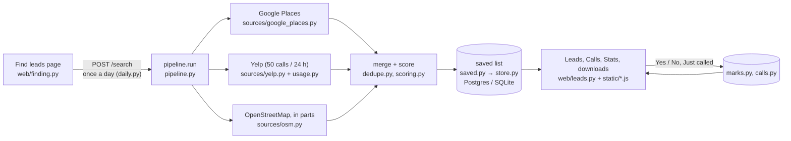

# Lead Finder: developer overview

How the code fits together, how to run it, and how it is tested. See also the
[sales guide](sales-guide.md) (what each page does) and the
[operator runbook](operator-runbook.md) (switches, deploys, alerts, database).

## How a search flows



In words: the Find leads page claims the day's search (`daily.py`) and runs
`pipeline.run` in a background thread. The pipeline asks each source (Google,
Yelp within its 24-hour budget, and the free map data in parts), keeps what is
within the radius, merges duplicates (`dedupe.py`), scores each business
(`scoring.py`, rules in `config.py`) and `saved.save_search` merges the result
into the one saved list, one row per business. The Leads, Calls and Stats pages
read the saved list (`/leads`, filtered, sorted and paged by the server) with the
marks and calls added; Yes / No and Just called write to their own tables and
never touch the saved row. Problems go to `alerts.py`.

## The search, step by step

1. **Geocode** the location (built-in table for SLC-area cities, then ZIP lookup, Google, or OpenStreetMap Nominatim).
2. **Search**: Google Places text search for your keywords, the competitor names, then ~27 business-type phrases, across 1/7/19 grid cells; Yelp's 13 category searches (most-reviewed first), then word searches for your keywords and the competitor names; and OpenStreetMap Overpass queries for matching tags and name words, one per area of up to 20 miles (several mirror servers are tried; a failed area is asked again in quarters; four minutes in all).
3. **Filter** to the exact radius (Haversine distance).
4. **Dedupe**: listings within ~200 m with matching names (or the same phone) are merged, keeping Google's (then Yelp's) contact details and OpenStreetMap's building size. Different phone numbers or names that only share generic words ("Inn & Suites Airport") are kept apart. Places Google or Yelp report permanently closed are then left out of the search's results and are never added to the saved list; a business already saved that is among them is flagged "Closed for good" there (it keeps its mark and calls).
5. **Score**, sort by score then distance, and **export**.

API responses are cached for 7 days (Yelp searches in the database), so
re-running the same search is instant and doesn't re-bill.

## Tests and checks

```bash
pip install -r requirements-dev.txt
python -m playwright install chromium          # for the browser tests
python -m pytest                               # SQLite
LEADGEN_TEST_DATABASE_URL=postgresql://... python -m pytest   # a throwaway Postgres
python -m ruff check .                         # lint (settings in pyproject.toml)
python -m vulture                              # dead code (settings in pyproject.toml)
python -m mypy                                 # strict type check (settings in pyproject.toml)
```

The code: `leadgen/pipeline.py` runs a search (sources in `leadgen/sources/`);
`leadgen/saved.py`, `marks.py`, `calls.py` and `daily.py` keep the saved data
(`store.py` is the database); `alerts.py` records problems and sends them to the
webhook. The website is `leadgen/web/`: `auth.py` (login),
`finding.py` (Find leads), `leads.py` (the saved list, marks, calls, stats,
downloads) and `common.py`. `export.py` lays out the CSV and Excel files and
`xlsx.py` writes the Excel format; `reference.py` copies the site's marks into
the scoring tests. The page's markup is `leadgen/templates/index.html`;
its script and styles are in `leadgen/static/` (`core.js` first, then one file
per page, then `start.js`). Spacing, radii and text sizes come from one scale of
CSS variables in `templates/_theme.html` (`--sp-1` … `--sp-6`, `--fs-sm` …
`--fs-xl`); use those rather than raw pixel values.

The tests never call Google, Yelp or OpenStreetMap (they are mocked).
`tests/test_browser.py` drives the real pages in Chromium (mark Yes, a
double-click marks one business only, Undo, Just called and its kept draft, the
Calls page opening on the latest call and keeping earlier notes in view,
competitors not asked Yes / No, the search confirmation, a refused search saying
why (in the browser and from the server), the phone cards and the short phone
header, Stats, downloads and their busy state, reload keeps the
view, the colour switch fitting from 320 px up, 44 px touch targets on a
phone, the Calls cards and every page link in view at 320 px, a closed business
keeping its mark, the skip link and the short Recent changes); it is skipped when Playwright's Chromium is missing.
`tests/test_closed_and_alerts.py` covers closed businesses in every view, the
downloads and Stats, an incomplete search giving the day back, and problem
reports (the webhook is mocked).
`tests/test_round6.py` covers the map data asked in parts (every query bigger than
one part fails, a failed part is asked again in quarters, a part that never answers
leaves the search incomplete with the other parts' businesses saved), closed
businesses never being added, refreshes after a big search staying one page at
most, the parsed saved list being reused, calls on unmarked businesses, and the
one re-run after an incomplete search. The browser tests also log a call on Not
checked, double-click Start search (nothing gets selected), and check "No street
address" and the tier words at desktop and 390 px.
`tests/test_cli.py` runs the command line with the sources mocked.

GitHub Actions (`.github/workflows/ci.yml`) runs the lint, the dead-code and
strict type checks and every test, on SQLite and on Postgres, for each push and
pull request; Render deploys only commits that pass, and branch protection on
`main` should require the three jobs (see "Deploying" in the [operator runbook](operator-runbook.md#deploying)). Every public function in
`leadgen/` has parameter and return annotations (`strict = true` for mypy).

## Command line options

```bash
python -m leadgen run --location 84101 --radius 30 --keywords compactor baler recycling --out leads.xlsx
python -m leadgen run --location "Ogden, UT" --radius 15 --out ogden.csv
python -m leadgen run --source google --grid 7                        # wider Google coverage
python -m leadgen run --source yelp --max-requests 20                 # Yelp only, 20 calls
python -m leadgen run --grid 7 --max-requests 300                     # wider, but capped spend
python -m leadgen run --min-score 40 --limit 200                      # only strong leads
python -m leadgen reference       # copy the site's Yes / No marks into the scoring tests
```

Yelp is only used on the command line when `DATABASE_URL` points at the
website's database, so its calls count against the site's one limit of 50 a
day (see the Yelp notes in the [operator runbook](operator-runbook.md#yelp-notes)). Without it, `--source yelp` stops with an
explanation, and `--source auto` leaves Yelp out and says so.

| Option | Default | What it does |
| --- | --- | --- |
| `--location` | Arco Compactor (876 Fortune Rd, Salt Lake City) | ZIP, city, address, or `lat,lon`. The radius and the Miles column are measured from here |
| `--radius` | 30 | Miles from the center; results outside are removed |
| `--keywords` | compactor baler waste recycling | Extra search terms; matches add points |
| `--source` | auto | `auto` = OpenStreetMap plus Google and/or Yelp when their key is set. Also `google`, `yelp`, `osm`, and `both` (Google + OpenStreetMap) |
| `--min-score` | 20 | Drop leads below this score (competitors are always kept) |
| `--grid` | 1 | Google and Yelp. 1, 7 or 19 search cells. Google caps each search at 60 results and Yelp at 240, so more cells find more businesses (and cost more). Yelp searches at most 25 miles around a point, so past 25 miles it needs 7 cells; at the default 1 it searches the 25 miles around the center instead when 7 would take more calls than are left |
| `--max-requests` | auto | Hard cap on API calls per run, for Google and for Yelp separately. Auto = Google: enough for every search (about 100 at `--grid 1`); Yelp: 50. Yelp never goes past its daily limit of 50 calls, whatever the cap. Under a cap, every search gets its first page before any gets a second; Google searches your keywords and the competitor names first, Yelp its category searches |
| `--only-keyword-matches` | off | Keep only leads matching a keyword |
| `--limit` | 0 (all) | Keep the top N prospects (competitors are always kept) |
| `--out` | output/leads.xlsx | `.xlsx` or `.csv` |
| `--api-key`, `--yelp-api-key` | from `.env` | Instead of `GOOGLE_PLACES_API_KEY` / `YELP_API_KEY` |

## Tuning after vetting

Everything adjustable is in `leadgen/config.py`:
- `CATEGORIES`: business types, their weights, and the Google types / Yelp categories / OSM tags / name words that identify them.
- `HIGH_VOLUME_BRANDS`: chains that almost always have a baler or compactor.
- `GOOGLE_QUERIES`: the search phrases sent to Google.
- `YELP_SEARCHES`: the Yelp category searches, `YELP_DAILY_LIMIT` (50) and `YELP_DEFAULT_MAX_REQUESTS`.
- `REVIEW_BONUS`: review-count thresholds for Google and Yelp.
- `COMPETITORS`: names and website fragments to flag.

## Limits and next steps

- OpenStreetMap coverage of businesses is uneven and often lacks phones; Google is recommended for production runs, and Yelp helps for stores, hotels and hospitals.
- The score estimates likelihood; it cannot see whether a compactor is actually on site. That's what vetting is for.
- Ideas from the spec for later: website text scanning / AI classification, USPS address validation, enrichment (employees, NAICS), scheduled weekly runs with email, CRM export.

---

© Wright AI Solutions. Back to the [README](../README.md).
