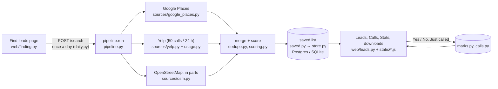

# Lead Finder: developer overview

How the code fits together, how to run it, and how it is tested. See also the
[sales guide](sales-guide.md) (what each page does) and the
[operator runbook](operator-runbook.md) (switches, deploys, alerts, database).

## How a search flows



In words: the Find leads page claims the day's search (`daily.py`) and runs
`pipeline.run` in a background thread. The pipeline asks each source (Google,
Yelp within its 24-hour budget, and the free map data in parts), keeps what is
within the radius, merges duplicates (`dedupe.py`), scores each business
(`scoring.py`, rules in `config.py`) and `saved.save_search` merges the result
into the one saved list, one row per business. The Leads, Calls and Stats pages
read the saved list (`/leads`, filtered, sorted and paged by the server) with the
marks and calls added; Yes / No and Just called write to their own tables and
never touch the saved row. Problems go to `alerts.py`.

## The search, step by step

1. **Geocode** the location (built-in table for SLC-area cities, then ZIP lookup, Google, or OpenStreetMap Nominatim).
2. **Search**: Google Places text search for your keywords, the competitor names, then ~27 business-type phrases, across 1/7/19 grid cells; Yelp's 13 category searches (most-reviewed first), then word searches for your keywords and the competitor names; and OpenStreetMap Overpass queries for matching tags and name words, one per area of up to 20 miles (several mirror servers are tried; a failed area is asked again in quarters; four minutes for the first round, then one catch-up round, and areas still missing are filled in in the background for up to an hour: `leadgen/fillin.py`).
3. **Filter** to the exact radius (Haversine distance).
4. **Dedupe**: listings within ~200 m with matching names (or the same phone) are merged, keeping Google's (then Yelp's) contact details and OpenStreetMap's building size. Different phone numbers or names that only share generic words ("Inn & Suites Airport") are kept apart. Then the parts of one named site become one lead (`merge_sites`): listings with the same *site name* (the cleaned name without building numbers or letters and words like "campus", "center", "building": "Shoreline Ridge 825" → "shoreline ridge"), each within 0.2 mi of the next and the whole site at most 0.5 mi across (`SITE_MILES`), with no phone numbers that differ. Names that are only numbers and generic words ("343 Apartments", "Building 2") never merge this way. Map areas and buildings keep their outline's bounding box (`Lead.outline`, from Overpass `bounds`), and a listing inside the outline (plus 0.2 mi) of one with the same site name is part of it however far apart the pins are (outlines over 8 mi across, like a forest, say nothing); the same name on two large sites (`config.LARGE_SITE_OSM_TAGS` / `LARGE_SITE_TYPES`: an air base, an airport, a campus) is one site within 1.5 mi (`LARGE_SITE_MILES`), for rows saved before outlines were kept; and names that differ only by a Utah town written into one (`town_added`: "Smith's Distribution Center" / "Smith's Layton Distribution", at least two distinctive words left) match as duplicates and, inside an outline, as one site, as do names that differ only by words naming a part of a site (`part_added`: "Intermountain Medical Center South Building" / "Intermountain Medical Center"; north, south, upper, annex, pavilion...). A building's outline named for part of the business it lies on or beside is a duplicate of it (`part_of_business`: a map listing with only building tags, whose name less part words is within the business's name, within ~200 m or inside its outline: "Cancer Hospital South" beside "Huntsman Cancer Hospital"); `merge` takes a business's own listing before a building's outline as the lead's base, so the lead is named after the business. Phone numbers that differ always keep listings apart. Pairs are found on a grid (`SiteIndex`) by where each site's listings are and how far its rules reach. The lead is named after the site ("Shoreline Ridge"), keeps every listing (the building names go into its other names) and the largest footprint. The saved list uses the same rules (`saved.py`): a later search's part joins the saved site, and a lead with listings of two saved rows joins the one saved first. Rows already saved as separate leads are merged only on request: `python -m leadgen merge-sites` lists the groups `dedupe.duplicate_groups` finds among the saved rows' listings (each row's listings start as one group, so two rows join only when every listing of one is a duplicate of every listing of the other, or as parts of one site) plus rows that share a listing id, and changes nothing; `--apply` merges them (calls and Yes / No clicks move to the row saved first, the latest mark wins, the merged rows stay hidden and are recorded in `merged_leads`). Searches never do this on their own. Places Google or Yelp report permanently closed are then left out of the search's results and are never added to the saved list; a business already saved that is among them is flagged "Closed for good" there (it keeps its mark and calls).
5. **Score**, sort by score then distance, and **export**.

Google and Yelp answers are cached for 7 days (Yelp searches in the database), so
re-running the same search is instant and doesn't re-bill; a search that reuses them
says so in its result (`sources/paging.py` `reused_note`: how many of its searches were
reused), and the Find page adds the day of the earlier search of the same place
(`web/finding.py` `_when_reused`, `daily.earlier_search`), so "0 new" reads as
"nothing new since then". The free map data's answers are kept for 12 hours only
(`OVERPASS_CACHE_TTL_SECONDS`): enough for the day's own retries and filling in, while
the next day's search of the same area asks the map servers again.

## Tests and checks

```bash
pip install -r requirements-dev.txt
python -m playwright install chromium          # for the browser tests
python -m pytest                               # SQLite
LEADGEN_TEST_DATABASE_URL=postgresql://... python -m pytest   # a throwaway Postgres
python -m ruff check .                         # lint and layout (settings in pyproject.toml)
python -m vulture                              # dead code (settings in pyproject.toml)
python -m mypy                                 # strict type check (settings in pyproject.toml)
npm ci                                         # the page scripts' lint and type tools (package-lock.json)
npm run lint:js                                # ESLint over leadgen/static/*.js (eslint.config.mjs)
npm run types:js                               # TypeScript's strict check of the same scripts (tsconfig.json)
```

The page's scripts are classic scripts that share their top-level names. Each lists the
names it shares at its top (`/* exported ... */`); ESLint lets the other files use only
those, so a misspelt or renamed function, an undeclared (implicit) global or an unused
name fails the lint, and the type check fails on a name no script declares or two
declare. The type check is strict (`"strict": true`, like mypy's for the Python): every
function's parameters have JSDoc types, a value that may be missing (`null`, an element
not on the page, a field the server may leave out) must be checked before use, and the
server's answers are read through the shapes in `types/page.d.ts` (`Lead`, `LeadsPage`,
`SearchesAnswer`, `Job`...), along with the page's state (`PageState`) and what the
scripts use from the page itself. A server change that adds or renames a field the page
reads updates that file too. Lines are at most 120 characters, as in the Python.

The code: `leadgen/pipeline.py` runs a search (sources in `leadgen/sources/`);
`leadgen/saved.py`, `marks.py`, `calls.py` and `daily.py` keep the saved data
(`store.py` is the database); `alerts.py` records problems and sends them to the
webhook. The website is `leadgen/web/`: `auth.py` (login),
`finding.py` (Find leads), `leads.py` (the saved list, marks, calls, stats,
downloads), `mapping.py` (the Map page's data, `/map-data`, from `leadgen/area_map.py`)
and `common.py`. `export.py` lays out the CSV and Excel files and
`xlsx.py` writes the Excel format; `reference.py` copies the site's marks into
the scoring tests. The page's markup is `leadgen/templates/index.html`;
its script and styles are in `leadgen/static/` (`core.js` first, then one file
per page, then `start.js`, then `tour.js`: the Tutorial button's step-by-step tour, whose steps are the `TOUR` list at its top; a browser's first visit is offered it once, remembered under `tour-offered` in its local storage). Spacing, radii and text sizes come from one scale of
CSS variables in `templates/_theme.html` (`--sp-1` … `--sp-6`, `--fs-xs` …
`--fs-xl`); use those rather than raw pixel values. Reading text is at least
14 px (`--fs-sm`); only badges and counts use `--fs-xs` (12 px).

The tests never call Google, Yelp or OpenStreetMap (they are mocked), and
`tests/conftest.py` makes sure of it, for the whole run: connections to anything
but this machine fail (in the socket layer and in requests, and the proxy
variables are removed from the environment first, so a proxy on this machine
can't carry a request out either), and the cache folder (with the SQLite
database) is a temporary one, set before the app is imported, so nothing is
written into the folder pytest was started from (no `.cache`). Every thread the
app starts is named `leadgen ...` (`leadgen.THREAD_PREFIX`: a search, its
heartbeat, a fill-in, a map query, an alert); after each test, while its stand-ins
are still in place, its fill-ins are ended and those threads are waited for. A
test that leaves one running for more than a few seconds fails (the thread is
stopped first, by pausing searching), and so does the run if any is alive at its
end; the pytest process exits as soon as it prints its result. A test that starts
a search waits for it to finish. For the browser tests, `LEADGEN_CHROMIUM` can point
at a Chromium binary when Playwright's own isn't installed.
`tests/test_browser.py` drives the real pages in Chromium (mark Yes, a
double-click marks one business only, Undo, Just called and its kept draft, the
Calls page opening on the latest call and keeping earlier notes in view,
competitors not asked Yes / No, the search confirmation, a refused search saying
why (in the browser and from the server), the phone cards and the short phone
header, Stats, downloads and their busy state, reload keeps the
view, the colour switch fitting from 320 px up, 44 px touch targets on a
phone, the Calls cards and every page link in view at 320 px, a closed business
keeping its mark, the skip link and the short Recent changes, and the Map page: AARCO's
pin, the circle, the nine areas and the missed one, every pin and its details, the group
and area toggles (kept after a reload), a pin opening the business on Leads, the dark
theme and a phone); it is skipped when Playwright's Chromium is missing. Every browser
window the tests open refuses requests to anywhere but the test server (`OUTSIDE`), so
the Map page runs without its street map, as it does offline.
`tests/test_map_page.py` covers `/map-data` (on SQLite and Postgres): the login, AARCO,
the circle and areas, every pin's fields, the shading from new records, a filling in,
a stopped search and old records, which search counts as AARCO's area's, thousands of
pins, and a real search around the shop with the northern areas failing.
`tests/test_closed_and_alerts.py` covers closed businesses in every view, the
downloads and Stats, an incomplete search saving what it found and using up the day, and problem
reports (the webhook is mocked).
Tests are named for the feature they protect: `tests/test_map_data.py` covers the
map data asked in parts (every query bigger than one part fails, a failed part is
asked again in quarters, areas busy servers missed are asked again automatically and
the search ends complete, a part that never answers leaves the search incomplete
with the other parts' businesses saved, the catch-up rounds' time limit);
`tests/test_fill_in.py` the background filling in of missing map areas (their
businesses saved without a second search, the record ending complete, areas that
never answer, pausing, a restart);
`tests/test_saved_list.py` closed businesses never being added, refreshes after a
big search staying one page at most and the parsed saved list being reused;
`tests/test_calls.py` calls on unmarked businesses and who made each mark and call;
`tests/test_daily_search.py` an incomplete search using up the day (no same-day re-run);
`tests/test_find_page.py`, `tests/test_search_words.py`, `tests/test_campus.py`,
`tests/test_downloads.py`, `tests/test_switches.py` and `tests/test_offline.py`
what their names say. The browser tests also log a call on Not
checked, double-click Start search (nothing gets selected), and check "No street
address" and the tier words at desktop and 390 px.
`tests/test_cli.py` runs the command line with the sources mocked.

The layout is checked rather than reformatted: ruff's formatter would undo the
aligned continuation lines, so `pyproject.toml` turns on pycodestyle's layout
rules (indentation, whitespace, blank lines, lines of at most 120 characters)
and the lint fails on a badly laid-out file.

GitHub Actions (`.github/workflows/ci.yml`) runs the lint, the dead-code and
strict type checks (and the page scripts' lint and type check) and every test, on SQLite and on Postgres, for each push and
pull request. Render deploys a push to `main` only once `lint`, `test (sqlite)`
and `test (postgres)` are all green (`autoDeployTrigger: checksPass` in
`render.yaml`, "After CI Checks Pass" in Render), so a red commit reaches `main`
but never the live site; branch protection on `main` (an owner setting, see
"Deploying" in the [operator runbook](operator-runbook.md#deploying)) keeps it off
`main` too. Every public function in
`leadgen/` has parameter and return annotations (`strict = true` for mypy).

**Sleeping and waking (`leadgen/awake.py`).** Render's free plan stops the site after 15
idle minutes. An outside pinger (cron-job.org, an owner step in the runbook's
[Keep the site awake](operator-runbook.md#keep-the-site-awake)) opens `/healthz` every 5
minutes in Utah working hours; `.github/workflows/keep-awake.yml` is the backup (GitHub
starts scheduled jobs late, so each run pings every 5 minutes for 50 minutes). `wsgi.py`
calls `awake.start(version)` once per process, in a `leadgen wake-up` thread:
`check_start` records the start in the additive `site_starts` table (when, and the
deployed commit, `RENDER_GIT_COMMIT`) and, for a start from 6:20 AM to 9 PM Utah time
with the same version as the start before (no deploy), reports "The site had gone to
sleep …" under Recent problems, at most once a Utah day (it looks for that day's text in
`problems`); `warm_up` reads the saved list once (`saved._parsing` makes overlapping
first requests share one parse). `/healthz` returns `up_since`, the process's start in
Utah time. On the page, `start.js` shows `#starting` ("Loading your leads…") until the
first list arrives, and after `TIMING.waking` (4 s) says the site is starting up and can
take up to a minute; after `TIMING.stillWaking` (45 s) it adds to reload if nothing
appears within two minutes. `TIMING` (in `core.js`) can be shortened in a browser test
through `window.leadgenTiming`. `tests/test_awake.py` and the browser tests
`test_a_slow_first_load_says_the_site_is_waking_up` / `…_quick_first_load_shows_no_starting_notice`
cover it.

**Commits.** One logical change per commit, with a message that says what changed
and why (the first line a short summary, then the details and how it was checked),
and its tests and documentation in the same commit; so `git log` reads as a list
of changes, `git bisect` finds the one that broke something, and any one of them can
be reverted on its own. A review round's fixes go in as one commit per fix, never as
a single "review round N fixes" commit. History is never rewritten (no rebasing or
force-pushing `main`): the live site deploys from it.

## Command line options

```bash
python -m leadgen run --location 84101 --radius 30 --keywords compactor baler recycling --out leads.xlsx
python -m leadgen run --location "Ogden, UT" --radius 15 --out ogden.csv
python -m leadgen run --source google --grid 7                        # wider Google coverage
python -m leadgen run --source yelp --max-requests 20                 # Yelp only, 20 calls
python -m leadgen run --grid 7 --max-requests 300                     # wider, but capped spend
python -m leadgen run --min-score 40 --limit 200                      # only strong leads
python -m leadgen reference       # copy the site's Yes / No marks into the scoring tests
python -m leadgen out-of-area     # list saved leads more than 60 miles from AARCO (--remove / --restore)
python -m leadgen backup          # copy every table with the team's work to leadgen-backup-<time>.json.gz
python -m leadgen restore FILE    # what a copy would add back (--apply adds it)
```

`backup` / `restore` (`backup.py`) copy every table in `store.SCHEMA` except the cache,
a running search's checkpoints and `site_starts` (`backup.SKIPPED`; its tables and their keys are read from the schema, so a
new table is copied too), in one transaction, to gzip-compressed JSON; a restore inserts
only the rows whose key is missing (`ON CONFLICT DO NOTHING`), never updating or deleting.
The nightly encrypted copy is `.github/workflows/backup.yml`; the steps are in the
[operator runbook](operator-runbook.md#backups-and-restoring).

`run` warns when the place is outside AARCO's area (`config.SERVICE_AREA_MILES`).
`out-of-area` (`cleanup.py`) is the only way leads leave the saved list, and only on
request: `--remove` moves the rows of leads nobody marked or called into the additive
`removed_leads` table, and `--restore` puts them back.

Yelp is only used on the command line when `DATABASE_URL` points at the
website's database, so its calls count against the site's one limit of 50 a
day (see the Yelp notes in the [operator runbook](operator-runbook.md#yelp-notes)). Without it, `--source yelp` stops with an
explanation, and `--source auto` leaves Yelp out and says so.

| Option | Default | What it does |
| --- | --- | --- |
| `--location` | AARCO Compactor (876 Fortune Rd, Salt Lake City) | ZIP, city, address, or `lat,lon`. The radius and the Miles column are measured from here |
| `--radius` | 30 | Miles from the center; results outside are removed |
| `--keywords` | compactor baler waste recycling | Extra search terms (they add businesses to look for; scores always use the defaults) |
| `--source` | auto | `auto` = OpenStreetMap plus Google and/or Yelp when their key is set. Also `google`, `yelp`, `osm`, and `both` (Google + OpenStreetMap) |
| `--min-score` | 20 | Drop leads below this score (competitors are always kept) |
| `--grid` | 1 | Google and Yelp. 1, 7 or 19 search cells. Google caps each search at 60 results and Yelp at 240, so more cells find more businesses (and cost more). Yelp searches at most 25 miles around a point, so past 25 miles it needs 7 cells; at the default 1 it searches the 25 miles around the center instead when 7 would take more calls than are left |
| `--max-requests` | auto | Hard cap on API calls per run, for Google and for Yelp separately. Auto = Google: enough for every search (about 100 at `--grid 1`); Yelp: 50. Yelp never goes past its daily limit of 50 calls, whatever the cap. Under a cap, every search gets its first page before any gets a second; Google searches your keywords and the competitor names first, Yelp its category searches |
| `--only-keyword-matches` | off | Keep only leads matching a keyword |
| `--limit` | 0 (all) | Keep the top N prospects (competitors are always kept) |
| `--out` | output/leads.xlsx | `.xlsx` or `.csv` |
| `--api-key`, `--yelp-api-key` | from `.env` | Instead of `GOOGLE_PLACES_API_KEY` / `YELP_API_KEY` |

## Tuning after vetting

Everything adjustable is in `leadgen/config.py`:
- `CATEGORIES`: business types, their weights, and the Google types / Yelp categories / OSM tags / name words that identify them.
- `HIGH_VOLUME_BRANDS`: chains that almost always have a baler or compactor.
- `GOOGLE_QUERIES`: the search phrases sent to Google.
- `YELP_SEARCHES`: the Yelp category searches, `YELP_DAILY_LIMIT` (50) and `YELP_DEFAULT_MAX_REQUESTS`.
- `REVIEW_BONUS`: review-count thresholds for Google and Yelp.
- `COMPETITORS`: names and website fragments to flag.

## Limits and next steps

- OpenStreetMap coverage of businesses is uneven and often lacks phones; Google is recommended for production runs, and Yelp helps for stores, hotels and hospitals.
- The score estimates likelihood; it cannot see whether a compactor is actually on site. That's what vetting is for.
- Ideas from the spec for later: website text scanning / AI classification, USPS address validation, enrichment (employees, NAICS), scheduled weekly runs with email, CRM export.

## How the pages behave (details)

The [sales guide](sales-guide.md) is the short, task-based version for staff; this is
the full behaviour, for whoever changes or supports the site.

The sidebar has five pages (Find leads, Leads, Calls, Map, Stats), a Light / Dark / System colour switch (System
follows the computer's setting; the choice is remembered in each browser), and
every page carries the Wright AI Solutions copyright. The browser tab names the
page ("Leads · AARCO Compactor Lead Finder") and shows the Lead Finder icon. The
company is **AARCO** (the owner's spelling; the site said "Arco" until 2026-10-03):
records saved before then (a search's place, the own-company flag on a saved lead) are
shown with the name it has now, by `daily._as_record` and `saved._ready`, without
rewriting them, and a listing or a search that spells it "Arco" is still AARCO's.
On phones and tablets every button and link is at least 44 px each way (on a
narrow window the "Only businesses matching the search words" tick box too). On a
phone or tablet (up to 820 px wide) the navigation is one short bar at the top (the
page counts show just the number; below 430 px the first link says "Find", its name
still "Find leads", so the five pages fit one row from 375 px up; on the narrowest phones
the links wrap to a second line, so Stats is never cut off, and the bar never takes
more than two rows), with the
tutorial, your name, the Yelp count, the colour switch and Log out under **Menu**; the
browser's own bar takes the sidebar's colour of the theme shown, light or dark,
including after a Light / Dark choice (`setThemeColor` in `templates/_theme.html`).
No table heading on any page breaks inside a word, at any width from 320 px (`th {
overflow-wrap:normal }`; headings wrap only between words, while names, notes and pasted
addresses in the cells still wrap anywhere; `test_no_table_heading_breaks_inside_a_word`
checks Stats, Leads and Calls), and the search history's numbers and **Details** don't
either (only the place searched wraps). Times are written
one way everywhere, in Utah time: "Sep 29, 2026, 4:43 PM", or "4:43 PM".
The first Tab stop on every page is **Skip to main content**, which jumps past
the sidebar to the page's list (Leads, Calls) or heading.

- **Find leads**: the search form (extra settings, each explained in plain
  words, under **More options**), a step-by-step progress bar while it runs,
  and the search history with each search's counts under **Details**, in plain
  words and in funnel order so the numbers add up: businesses found per source,
  listings within the radius, duplicates merged, businesses after merging, then
  what was left out (closed for good, a score below the minimum, e.g. "Left out:
  score below 20", not matching the search words, over a lead limit), leads kept,
  competitors among them, the leads per tier A to D, then the paid lookups and how
  long it took. Before anything is spent, the page asks the server where the search will
  run (`GET /place`, `web/finding.py`): the place found for what was typed (offline for
  AARCO's shop, typed as its address, "AARCO" or the old spelling "Arco", and the Salt
  Lake area's towns in `geo.UTAH_PLACES`, typed bare or with ", UT";
  online lookups ask in Utah first unless another state is named) and its distance from
  AARCO's shop (`config.SERVICE_CENTER`). The confirmation names both. A place more than
  `config.SERVICE_AREA_MILES` (30) away needs a second confirmation (`#far-dlg`, its safe
  button focused); `POST /search` refuses such a place with 409 `confirm_far` unless
  `confirm_place` names that same place (within a mile), and it looks the place up before
  the day is claimed, so an unknown or unconfirmed place spends nothing. The search then
  runs around exactly that point (`SearchParams.center` / `place`, no second lookup), and
  the day's record keeps `place` and `miles`, which the history shows under what was
  typed. Pausing searching stops a running search within seconds: `osm.search` takes a
  `stop` callable (`config.stop_reason`), looks at it every `STOP_CHECK_SECONDS`, asks no
  more mirrors once it says stop, and raises `osm.Stopped` with what it had; the result's
  `stopped` reason marks the job and the record. The form checks itself before anything runs: **Search around** must
  not be empty (it is never quietly replaced by AARCO's address), and the search
  words are limited to 20, each up to 60 characters (the hint says so). When
  a search can't start, whether the browser catches it or the server refuses
  (a bad value, today's search already run, searching paused, the database
  down), the reason shows in red under **Find leads** and next to the field it is
  about, and stays until the form is edited. The note beside the button (how the
  day stands, e.g. "Today's search ran at 4:43 PM") is plain grey text.
  When a search finishes, the page gets only the counts it shows ("N new leads,
  M saved leads in all"), not the saved list, so finishing stays quick however
  long the list grows. **Find Leads works once per calendar day** (Utah time), for the whole site:
  after today's search it is off until midnight, and the form says so at its top
  ("Today's search is used up") with its fields greyed out. A blank **How far** or
  minimum score is refused beside the field ("How far must be between 1 and 100
  miles"), in the browser and by the server, never quietly replaced by the
  default. Pressing **Find leads** first
  shows a summary (location, miles, search words, sources) and says this uses
  today's only search: **Start search** runs it, **Go back and edit** (or Escape)
  leaves the day unused. A search that fails outright
  (e.g. an unknown location, or the map data service is down) gives the day
  back, says so in one or two plain sentences (with one piece of advice: "You
  can try again now; if it fails again, try later today"), and stays in the history marked
  **Failed** with the reason. A search a server restart cuts off (a deploy lands
  mid-search) keeps what it had found: while a search runs, what its sources return
  (each Google or Yelp results page, each map area, reported through
  `sources.report_found` on the search's thread) is written to the `search_found`
  table every 10 seconds, and its `search_runs` row says it is alive
  (`leadgen/interrupted.py`; the process marks its runs as ended when it exits). The
  next page that loads the search history or starts a search finishes a run whose
  server is gone (marked ended, or no heartbeat for 45 seconds): its listings are
  merged, scored and saved like a search's own, and the day is given back at once,
  with a history row marked **Interrupted** that says how many businesses were saved
  ("Interrupted by a server restart (the site was updated or restarted): the 128
  businesses it had found were saved. It didn't use up the day's search."). Until
  then Find leads says the search was cut off and checks again every few seconds.
  It is never re-run by itself (that would spend paid lookups without anyone asking).
  A search's working rows are removed when it ends. One with no such rows (from
  before this, or when they could not be written) stops holding the day after 30
  minutes, as before (the page says when, in Utah time). A search
  where one source failed while the others worked (say Google refused its key,
  or the map data service was down) is **incomplete**: the businesses the other
  sources found are saved and the day is used up, as the owner asked (one search
  per Utah day). The page says which source is missing and that today's search is
  used up all the same (for Google or Yelp: "ask whoever looks after the site to
  check the key"), and the history shows the search's lead count marked
  **Incomplete**, with the reason. There is no same-day re-run (the owner's decision,
  recorded 2026-09-30 in the runbook): a further search that day is refused with "the
  next search can run tomorrow, from midnight Utah time". A source switched off by the
  administrator is not a failure (the day is used as usual). At the bottom of the
  page, **For the site administrator** (a quiet section, closed until opened)
  holds **Recent problems** (failed or incomplete searches and server errors of the
  last 7 days) and the **site switches**; each switch asks first, naming its effect
  ("Pause all searching for everyone? ..."), and Cancel leaves it as it was. The problems list is there so nobody has to read the logs to
  notice them (see "Problems: the webhook" in the [operator runbook](operator-runbook.md)). The public map servers often
  refuse or time out on one big query, so a wide search asks the free map data
  **in parts**: a grid of areas up to 20 miles wide (`OVERPASS_PART_MILES`; a
  30-mile search is 9 areas), two at a time, **nearest the centre first** (the area
  the search's centre is in, then outwards; a failed area's quarters take their place
  in that order, `osm._distance`), each starting at a different map server (the
  progress text says "3 of 9 parts of the area done": the search's areas, fixed for the whole
  search, an area asked in quarters counting once all four answered; the count only
  moves forward and stays in the text through the catch-up round). An area no server answers is
  asked again as four smaller ones; if one still gets no answer, the search is
  **incomplete** (the businesses from the areas that answered are saved, as
  above), and the record keeps how much answered (`stats["osm areas searched"]`,
  "about 8 of 9 areas"; the page words it, see `fillin.coverage` below). Answers are kept for 12 hours whichever mirror gave
  them (`OVERPASS_CACHE_TTL_SECONDS`, so tomorrow's search asks again), and an area that had to be asked in quarters is asked in quarters straight
  away on a re-run, so a re-run with the same location and radius only asks for the
  areas still missing. The first round gets four minutes (`OVERPASS_DEADLINE_SECONDS`),
  an area 90 seconds. Areas still missing after it (the servers were busy or
  throttling) are asked again automatically in one more round
  (`OVERPASS_RETRY_ROUNDS`), after a 20-second pause (`OVERPASS_RETRY_PAUSE_SECONDS`)
  with 150 seconds of its own (`OVERPASS_RETRY_SECONDS`), so the map-data step
  never takes more than about 7 minutes; the progress text says "asking again for
  the parts the busy servers missed" (the record keeps how many were asked again,
  `osm areas asked again`, an internal count the page never shows). Areas still missing then are **filled in in the
  background** (`leadgen/fillin.py`), within the same search: the search reports
  what it found and uses up the day as usual, and a background thread asks the
  missing parts again every 5 minutes (`FILL_IN_PAUSE_SECONDS`) for up to an hour
  (`FILL_IN_SECONDS`), never asking Yelp or Google. What they find is merged,
  scored and filtered like the search's own (`pipeline.finish_leads`) and saved
  into the list as it arrives; the day's record gets a `fill` entry (state
  filling / complete / gave_up / stopped, areas left and the towns they hold
  (`where`: each missing area's biggest town from the bundled places table, or its
  direction from the centre, nearest first: `osm.areas_text`), businesses found and
  new). **How much of the area a search covered is said once**: `fillin.coverage(record)`
  words it from the record's numbers each time `/searches` is read (`finding._for_page`),
  as `coverage.text` (the Find page's one status, `#coverage-note`, polled every 30
  seconds while filling) and `coverage.short` (the one Details line, "Free map data:
  area covered"); the history row tags "Filling in". `fillin.plain_notes` leaves the
  coverage out of the search's notes (and drops what earlier versions stored about it),
  `fillin.plain_reason` rewords an earlier version's reason, and the note beside a
  finished search only names a source that couldn't be reached at all. The stored
  reason keeps the technical form ("about 6 of 9 areas searched; not yet: ...") for
  the problem list and the Map page. Complete, the
  search is no longer marked incomplete; parts that never came in are reported
  as a problem (and the webhook). Pausing searching stops it within a few seconds (between rounds it
  looks at the switch every `osm.STOP_CHECK_SECONDS`, not only at the next round; Find leads then
  polls every 2.5 seconds until it has ended), and a fill-in cut
  short by a restart reads as interrupted (`daily.FILL_GRACE_SECONDS`). Only an
  area that never answers even then leaves the search incomplete; a map server that
  hasn't answered an area after 25 seconds (`OVERPASS_STAGGER_SECONDS`) is not
  waited out: the next one is asked as well and the first good answer wins.
  **Progress** goes from the search to the page as values, not as text to parse:
  each message is a `progress.Step` (a `str`, so the command line prints it as it
  is) carrying its step (locate, Yelp and Google, map data, merge, save), done and
  total (calls made of the calls a paid source may make; map areas done of the
  search's areas), the paid source and a note ("split", "retry", "another",
  "stopped"). `web/finding.py`'s `_Progress` words the page's message from those
  values (`plain_progress`) and draws the bar: each step has a share
  (`STEP_WEIGHTS`), a step the search skips has none, and once past Yelp and Google
  their share is the calls they really made, so a map-data-only search starts near
  0% and its bar tracks the area count; the percentage never goes back. The progress bar says when a step
  is taking longer than usual. Steps that don't apply (Google and Yelp when
  neither is set up) are shown as skipped.
- **Leads**: the saved list, with **Yes** / **No** buttons for "has a baler or
  compactor" and tabs for Not checked, Has baler or compactor, No baler or
  compactor, Competitors, Closed and All. A saved business that a later search
  reports **closed for good** stays in the list with its mark and calls, flagged
  "Closed for good" in red: it leaves Not checked (there is nothing left to
  check), stays under Has / No baler or compactor if it was marked, and every
  closed business is under the **Closed** tab. It stays on the Calls page and in
  the downloads (the flag is in the Flags column), and Stats still counts its
  mark: the mark says what it had while it was open. If a later search finds it
  open again, the flag goes. Competitors and AARCO's own listing are
  flagged (orange) and have their own **Competitors** tab: they aren't prospects,
  so they get no Yes / No buttons, aren't in Not checked and aren't counted in
  Stats (they still appear under All and in the downloads). The sidebar badge
  counts the prospects still to check. The server filters, sorts and pages the
  list: `GET /leads` always answers with one page of rows (`offset` / `limit`, 100 by
  default, `PAGE_SIZE`) and the exact tab counts, never the whole saved list, and
  **Show more** fetches only the next page (`offset` = the rows already shown) and adds
  it under them. While a Yes / No is on its way the row says "Saving Yes…" with both
  buttons disabled; the answer, "Marked by" and "Saved. Moves to …" appear only once
  the server confirms. A failure leaves the answer as it was, and the row says
  "Yes not saved." with the reason, **Try again** and **Dismiss** until the answer is
  saved or dismissed (`S.failed`, by lead; a toast says it too, but goes). Every save
  (a Yes / No, a call, a verified contact, an undo) goes through `core.js` `save()`:
  after `TIMING.saveSlow` (10 s) the row, or the open box (`#call-slow`,
  `#contact-slow`), adds "This is taking longer than usual. Still trying…"; after
  `TIMING.saveLimit` (30 s) the request is cancelled (`AbortController`, so a late
  answer never changes the page) and it fails like an offline save, "… didn't answer
  within 30 seconds, so it may not have been saved". Trying again is safe: a call
  carries its own id, and the same Yes / No or contact again changes nothing. A Yes /
  No that reached the server after the page gave up clears its note at the next
  refresh (`settleFailed`). `test_a_save_that_gets_no_answer_says_so_and_can_be_tried_again`
  checks it with `/mark` and `/calls` never answering. A
  business just marked stays where it is, showing its answer ("Saved. Moves to
  …") and its Undo, until the pointer leaves the list (then a few seconds), or
  you change tab, filter or sort, so a double-click or a quick second click can
  never mark the next business by mistake. A mark
  is kept for good: it can be switched between Yes and No, and a later search
  that finds the business again updates its row without moving it. **Every
  click can be undone for 5 minutes**: from the Undo link on the row (with the
  time left) or from **Recent changes** above the list, even after a reload.
  The server remembers what each click replaced, and refuses an undo once a
  newer change has been made to that business (e.g. by a colleague). Recent
  changes shows the latest two (one on a phone), with **Show all** for the rest, so the list
  stays in view. Click a
  column heading (Score, Business, Contact, Miles) to sort. **Has phone** shows only
  businesses with a phone number (`phone=1`), and under Not checked the best-score
  order puts, among equal scores, the ones with a phone first. The tab, filter,
  tier, Has phone and sort are kept in the address, so a reload or a shared link shows the
  same view. **Download Excel** / **Download CSV** say "Preparing Excel…" while
  the file is built (10,000 leads take about a second) and ignore a second click
  meanwhile; the files are named with the Utah date (`compactor-leads-2026-09-30.xlsx`).
  Miles show one decimal for every lead ("4.6", "2.2"; the downloads keep two). A
  lead's type ("Waste / recycling facility") shows under its category only when it
  says something the category doesn't. On touch screens links in a lead's contact
  lines keep a 44 px tap area with negative margins, so the lines stay one text line apart. Phone numbers are tap-to-call links; a business without one says
  "No phone listed", and one without a street address says "No street address"
  (next to its map link). Each score shows its tier and what the tier means
  ("55" over "B likely": A strong, B likely, C possible, D weak; hovering says
  it in full). The list refreshes every
  minute and when you come back to the tab, so colleagues' marks and calls show
  up without a reload; each refresh only fetches the businesses that changed
  (`GET /leads?since=…`, which also sends the new tab counts): in full the ones
  in the view shown, just their id for the rest, and when more changed than the
  page shows (a search just touched them all) the page simply asks for the rows
  it shows again, so a refresh is never bigger than one page. The server keeps the
  parsed saved list between requests and reads it again only when a search has
  changed it, so opening a tab stays quick however long the list grows.
  **Just called** is on every business (not competitors): staff usually find
  out whether a business has a baler by phoning it, so a call can be logged
  before it is marked, and logging a call never changes its Yes / No answer.
  Below 1,100 px wide (tablets, small laptops, phones) each lead is a card
  (two or more side by side where there is room): the business name with its
  score and tier, right above its **Yes** / **No** buttons and **Just called**,
  then the address with a map link, the tap-to-call phone and the miles, then
  the reasons for the score. Nothing scrolls sideways; a **Sort** list replaces
  the column headings. Below 700 px (phones) the reasons sit behind **Why this
  score**, the tabs become one **Show** list (the Calls page's result tabs too,
  with their counts), the page's intro line is hidden,
  Recent changes shows one line, and the downloads and the call hint move below
  the list, so the first lead is in view on opening. With nothing saved yet the
  page offers **Go to Find leads** and hides the downloads; a filter that
  matches nothing says what was filtered, in which tab, with **Clear filters**.
  Each mark and call records the name set under **Your name** in that browser
  (asked once, before the first mark or call; it can't be skipped: **Cancel**
  drops the click, and saving an empty name is refused); the name shows under the row ("Marked by Dana"), in Recent changes,
  in the call History, on the Calls page and in the downloads' **Marked By** and
  **Called By** columns. Names are kept in their own table (`made_by`, by the
  mark change's or call's id), so marks and calls from before it simply have
  no name.
- **Verified phone and contact** (`contacts.py`): **Add verified phone or contact**
  under a lead's phone (Leads and Calls) opens a box for a phone (with its area
  code: 10 digits, or 11 starting with 1, before any extension) and who to ask for,
  saved by `POST /contact` with **Your name**. Each save is a new row of
  `lead_contacts` (id, uid, phone, contact, by_name, at): the latest row per lead is
  its verified contact (`contacts.apply` sets `Lead.verified_phone`, `contact_name`,
  `contact_by`, `contact_at` and `contact_saves`; none of them is stored in the
  `leads` row, so `saved.save_search` never touches them), both boxes empty takes it
  off, and the same details again add nothing. The page shows it under the listing's
  phone with who saved it; **Earlier versions** (more than one save) opens History,
  which lists every save. The downloads put **Verified Phone**, **Contact Name** and
  **Verified By** after **Phone** (left out when no lead has one). **Has phone** and
  the phone-first order count a verified number, the filter looks in the contact
  name, open pages pick up a colleague's save like a mark (`changed_uids`), and
  `merge-sites --apply` moves a merged row's saves to the row it joins.
- **Calls**: on any business on the Leads page, whatever its Yes / No answer,
  **Just called** opens a
  Conversation Summary box and the result of the call (Interested, Follow Up,
  Not Interested, Not Qualified, No Contact or Bad Lead). Every call is kept
  for good (a saved call can be undone for 5 minutes, like a mark); **History**
  shows them all. Typed notes are never lost: closing the box (Cancel, Escape,
  even a reload) keeps them as a draft for that business in this browser until
  they are saved. A call sent twice (a retry on a flaky connection) is recorded
  once: the page gives each call its own id. The Calls page lists every called
  business, whatever its mark, and opens on **All
  called businesses**: one row per business, latest call first, so a call just
  saved is in view (every call is under **History**); then there is a tab per
  result, where a business sits under its latest call's result (`#calls?tab=Follow Up`
  in the address opens that tab). The server pages, filters and counts the Calls
  list like the Leads list (`GET /leads?tab=called&sort=called&dir=desc`, plus
  `outcome=` for a result's tab): one page of `PAGE_SIZE` businesses at a time,
  **Show more** asking for the next (`offset=`), and `call_counts` (every called
  business the filter keeps, and each result's share) for the tabs, however many
  businesses were called. A filter box above the tabs narrows the list (and the tab
  counts) to businesses whose name, town, ZIP, category, address, type or flags, or
  whose calls' summaries, results and callers (`calls.search_text`), hold every word
  typed, in any order (the Leads filter's rule, `web/leads.py` `matches`, so
  "walmart layton" works on both pages; only Calls looks in the calls); it is asked
  for once typing pauses, kept in the address (`#calls?q=costco`), and with no match
  the page says "No calls match ..." with **Clear filter**. While a tab, filter or
  sort is on its way the old rows stay dimmed (`aria-busy`); after 300 ms
  `core.js` `loadingCue` says "Loading…" over them in a `role="status"` box, and
  after 5 s that it is taking longer than usual. On a desktop (1024 px and wider)
  a call's date and time, and **Undo call (m:ss)**, each stay on one line. The call box's **Save** is always
  pressable: without a result picked, a hint beside "How did it go?" and a red line
  say to pick one, and the result buttons are ringed. The Conversation summary column shows the
  latest call's notes; when the latest call had none it says so and shows the
  most recent notes from an earlier call, with that call's date (the downloads'
  Call Notes column does the same). With no calls yet it says how to log one.
  Below 700 px wide (phones) each called business is a card like on the Leads
  page: name and latest result, the tap-to-call phone, the Conversation summary,
  then **Just called**, **History** and Undo, with nothing scrolling sideways. A
  business closed for good says so under its name.
- **Map** (`map.js`, part 6; `web/mapping.py` and `area_map.py`): one read-only request,
  `GET /map-data`, behind the login like every page, answers everything drawn:
  - AARCO's pin (`config.OWN_COORDS`, labelled AARCO, always on top) and the circle of
    `SERVICE_AREA_MILES` around `SERVICE_CENTER`.
  - The areas a search asks the free map data in (`osm.area_boxes`, the "N of 9 areas"
    of its progress), each cut to the circle and named by `osm.area_name` like
    elsewhere (its biggest town, else "The area to the north-west"), with up to three
    more towns for the list under the map. An area name that would cover another, AARCO's
    pin, or the map's edge waits until the map is zoomed in (`placeLabels`).
  - The shading, from the latest search of AARCO's area (`area_map.latest_search`: the
    newest day's record that found leads, ran within 0.1 mile of the shop with the
    service area's miles, and used the map data). A search now records its centre
    (`center`) and the boxes of the parts no server answered for (`map_areas.missing`,
    `[]` when all did, `[null]` when none did, `{"known": false}` when stopped), and the
    filling in keeps its own list as areas answer (`fill.boxes`). An area all of which
    is missing is "missed" (or "asking" while being filled in), one partly missing is
    "partly", the rest "searched". A search recorded before those keys existed is read
    from its words: complete means all searched, "Couldn't reach ... the map data
    service" all missed, and the towns its note or filling in named as missing mark
    those areas, the others searched only when that list is surely whole (else "not
    known"). Nothing rewrites the old records.
  - A pin for every saved lead with a map position (`fields` names each pin's short
    list: key, lat, lon, group, name, tier, score, phone, verified phone, address,
    outcome, called, closed, kind), from the same parsed saved list as the Leads page, so
    a few thousand stay quick (3,000 in about 0.03 s, about 400 KB); `no_position` counts
    the rest. Groups: `yes`, `no`, `unchecked`, `competitor` (competitors and AARCO's own
    listing, `pipeline.EXEMPT_TYPES`).
  The map is Leaflet 1.9.4, vendored in `leadgen/static/vendor/leaflet` (with its BSD-2
  licence and a README saying where it came from), loaded the first time the page opens.
  Dots are drawn on one canvas (a wider tap tolerance on touch screens); competitors are
  hollow squares and AARCO a teardrop with a star, as HTML markers that take the keyboard.
  Colours come from `_theme.html` (`--pin-*`, `--aarco*`, `--area-*`), checked with a
  colour-blind validator in both themes, and every colour is also named in words (the
  key, the details box); the canvas is redrawn in the new colours when the theme
  changes (`restyleMap`). Hidden groups are remembered under `map-hidden` in local
  storage. The street map is OpenStreetMap's tiles (`tile.openstreetmap.org`, credited
  in the corner); the dark theme inverts and dims them. When they fail the page says so
  and draws everything on a plain background. A pin's **Open on the Leads page** opens
  `#leads?tab=all&lead=<id>`: `/leads` takes `lead=` (a uid, at most 64 characters) and
  the page says "Showing one business, opened from the map." with **Show the whole list**;
  any other filter or tab change drops it.
- **Stats**: how many businesses have a baler or compactor (marked Yes), their
  average score, and a chart of the share of checked businesses (marked Yes or
  No) that have one, by tier. Competitors and AARCO's own listing are left out of
  every figure (the page says how many), since the numbers measure how well the
  scoring finds prospects. Businesses that have since closed for good still
  count (the page says how many of the checked ones have closed). On a wide
  screen the table sits beside the chart. When tier D has no checked businesses, the page
  says why, truthfully whatever minimum score the searches used: either it is empty
  (searches leave out scores below the minimum, 20, unless a search lowered it under More
  options), or how many saved tier D leads there are, none checked yet (`by_tier[].saved`). Before anything is marked, the page
  shows only a note saying how to fill it, with a link to the Leads page.

Marks and the latest call (result, time and notes) are also columns in the downloads.

If the database can't be reached, each page says so in one plain message with a
**Retry** button (nothing is lost), and Find leads and the downloads are off
until it is back. If only the Yes / No marks or calls can't be read, the pages
say that too rather than showing every business as unchecked. Unknown
addresses and server errors show a branded page with a link back.

## How a business gets its category

`scoring.classify` reads a business's facts once (`Facts`: its name, Google types,
Yelp aliases and map tags, and the categories they match) and then asks the rules
in `scoring.RULES` in order; the first rule that decides gives the category. The
lead's stored explanation (`lead.reasons`, the scoring's own record) names it for
whoever maintains the rules ("category rule (retail chain): a retail chain's name
decides over the building it is mapped as"), and `scoring.classify(lead).rule` gives it
at any time. Salespeople never see that: the Leads page (`web/common.py lead_json`)
and the downloads' "Why This Score" (`export.py`) show `scoring.plain_reasons(...)`,
which says how the category is known in their words ("(from the map listing)",
"(from its name)") and puts each rule's `note` in place of its name ("Only the
building type or the business name suggests what it does — confirm before calling";
no note when the category's own line says it all). It reads the explanations saved
by earlier versions too, so saved leads never need rewriting. A new rule needs a
`note` (or "" on purpose); `tests/test_classify_rules.py` and `tests/test_downloads.py`
fail if a rule name, a rule's text or terms such as "map tag" or "catch-all" reach the
page or a download. `scoring.VETOES` are the narrow exceptions that hold
a category back before any rule runs (a campus word on a place that is not the
campus, a production word in a small shop's name...). To add a rule or a veto, add one
entry to the table where it belongs in the order and one example business to
`tests/test_classify_rules.py` (a test fails when a rule or veto has no example).
The scoring tests and the scoring reference file below must still pass.

Three rules give no category by what a name says: a clinic or outpatient centre mapped
as a hospital (`config.CLINIC_NAME_WORDS`, unless the name also says hospital; its
operator's brand earns nothing either), a power, heating or cooling plant
(`config.SERVICE_PLANT_NAME_WORDS`) and a car or truck wash (`config.VEHICLE_WASH_*`).
A map name that only describes a building (`scoring.needs_name`: "Office and
Warehouse, West", with no address, phone or website) is held at
`config.NEEDS_NAME_MAX_SCORE` (tier D, below the default minimum, so a search leaves
it out) and flagged `config.NEEDS_NAME_FLAG` (`scoring.mark_needs_name`). Saved rows
show the same way as they are read (`saved._ready`); the stored row is unchanged. The
reference file's **needs_name** list and its round-21 **not_prospect** and
**name_traps** entries hold these cases.

## The scoring reference file

Leads are always scored with the default keywords (compactor, baler,
waste, recycling), whatever a search typed (typed words only choose what is
searched for and, with "only keyword matches", what is kept; the minimum score
is applied to this same score), so a business's score and tier
depend only on facts about it and the Stats page's tiers stay comparable over
time. `tests/fixtures/scoring_reference.json` lists reference businesses and
whether they run a baler or compactor; a test fails if a scoring change stops
ranking them where they should. Its **not_campus** list holds places named after a
university or college that are not the campus (a community garden, a president's
house, condominiums, a department, a press, a library): `config.NOT_CAMPUS_WORDS`
keeps them from scoring as a campus prospect, so one campus is one lead. Businesses
marked **not_prospect** (a police impound lot, a fire department's training and
logistics centre, a trailer yard, a parcel-locker brand) must get no prospect
category and score below the default minimum: `config.NON_PROSPECT_NAME_WORDS`
(police, sheriff, fire department, impound, trailer yard, fleet maintenance, parcel
lockers, Luxer...) outrank every tag and name word, unless a specific recycling or
transfer-station tag says otherwise, and police / fire-station / parcel-locker tags
are non-prospect tags. The **not_prospect** list also holds small utility and
infrastructure structures from a real 30-mile search ("6th East Well", a
pumping station; "Pacificorp", "Utah Power & Light Co", "UTA Station", "D04",
all tagged only building=industrial and under 5,000 sq ft): a pumping station,
water well, substation or similar tag (`config.UTILITY_OSM_TAGS`) gives no
prospect category, and a place known only by a catch-all industrial tag gets none
when its footprint is under `config.SMALL_GENERIC_BUILDING_SQFT` (5,000 sq ft) or
its name or operator tag says it is a utility's, a city's or a transit agency's
(`config.UTILITY_NAME_WORDS`, `config.UTILITY_OPERATOR_WORDS`), unless an
industrial use tag or a telling name ("... Plastics") says it is a plant. It
also holds what a later real search got wrong: self-storage ("Library Storage",
"Magna Safe Storage", "Storage Warehouse": `config.SELF_STORAGE_*` tags, Google
types and name words, or the word "storage" without a cold-store or logistics word)
gets no prospect category, and neither does a catch-all industrial building whose
name says it is a data centre, a career centre or a city's shops
(`config.NOT_PLANT_NAME_WORDS`: "Flexential ...", "Utah Career Center", "Woods
Cross City Shops"). Its
**name_traps** list holds names that hold another business's name or a misleading
word: "Tru by Hilton Clearfield Hill Air Force Base" gets no air-base brand bonus (a
high-volume brand counts from the name only when the map's own brand tag doesn't
name another brand, a place-name brand in `config.PLACE_NAME_BRANDS` opens the
name, and no location word from `config.BRAND_LOCATION_WORDS` ("near", "at",
"by"...) comes just before it), and "Deseret Industries Thrift Store" is retail,
not a plant (`config.NOT_MANUFACTURING_NAME_WORDS` and a landuse=retail tag cancel
a manufacturing name word). "Harbor Freight" is mid-size retail, whatever
building it is mapped as (`config.RETAIL_NAME_BRANDS`: a retail chain whose name
holds a warehouse word never counts as a warehouse or plant), and "Liddiard
Furniture" tagged shop=mall is a shop, not a venue (a shop=mall tag counts only when
the name has no shop word from `config.SHOP_NAME_WORDS`, or has a mall word from
`config.MALL_NAME_WORDS`). Its **generic_names** list holds map listings named only
"Recycling" or "Junkyard": the map data adds the operator, street or city to such a
name (`osm.parse_element`), and one still known only by the word (or the word plus
its street) scores `config.GENERIC_NAME_PENALTY` less, so it ranks below a named
place of the same kind. Its **confirmed** list holds real businesses
AARCO's staff marked Yes / No on the Leads page, with the tier each had:
`python -m leadgen reference` (with `DATABASE_URL` set to the website's
database) refreshes it from the site's marks, copying only the facts the
scoring reads (no phone numbers, addresses or call notes). A test then fails
if a scoring change moves a business marked Yes to a lower tier, or one marked
No to a higher one. The site offers the same file with no database address
needed: **For the site administrator** > **Scoring check** > **Download the scoring
check file** (`/download/scoring-reference.json`). **Routine:** once a month, the
owner (Thomas) downloads it and sends it to whoever looks after the code, who puts
it in place of `tests/fixtures/scoring_reference.json`, runs the tests and commits
it; if the tests fail, or on the Stats page tier A's Yes share is not above tier
C's, the weights in `leadgen/config.py` need adjusting (say so in the commit).
Its **not_production** list holds small shops and eateries whose name has a
production word ("Day Dairy Barn"): `config.NOT_PRODUCTION_NAME_WORDS` keeps a name
alone from making them a food & beverage plant.

## The downloads' columns (details)

Score, tier, lead type, flags, name, category, address, city, state, ZIP,
phone (formatted), website, distance, why-this-score, matched keywords, Google
and Yelp review counts, approx. footprint, source category, which searches found it,
source(s), map link, lat/lon, "Has Baler or Compactor?", who marked it, the latest call's
result, time, who made it and its notes, plus empty **My notes: equipment seen (this file only)** (a dropdown: saw a
compactor, saw a baler, saw neither, not sure) and **My notes (this file only)**
columns for private notes on a printed or offline copy:
nothing typed there goes back into the website (record Yes / No and calls on
the Leads page). A second sheet, **Run Info**, records when it was made (Utah
time) and what the file holds: for a search, its settings and counts; for the
saved list (**Download Excel** on the Leads page), how many leads, how many are
marked Yes / No / not checked, competitors and own listing, the count per
tier, how many were called, and when the first and latest search started (the
search history's "When"; "First saved" / "Latest saved" for leads saved with no
search on record). A lead with no city or ZIP gets the town / ZIP area its map
position is near (`leadgen/places.py`, offline, from `leadgen/data/places.json`:
the Census 2023 Gazetteer's places and ZIP areas within 200 miles of Salt Lake
City), written "near West Jordan" / "near 84088" and explained on Run Info. A
listed city is shown (pages, City sort, filter, downloads, command-line listings)
as `places.tidy_town` reads it against the same table: case, punctuation, a state
after it, "City" added or left off, short words ("W", "Mt", "Hts") and a plural "s"
don't matter; a few letters only the nearby town starts with (or the initials of a
town) become that town; unknown towns are kept, in title case when they were all
capitals or all lower case. The saved rows are never rewritten. To
rebuild that table (a new Gazetteer year, a missing town), run
`python -m leadgen.build_places --download` (or give it the two Gazetteer files;
`--check` only says whether the file would change, `--year` picks another year);
its docstring lists the source URLs and the filter, and from the 2023 files it
writes the committed file byte for byte. The
Excel file is written by `leadgen/xlsx.py` in time that grows in step with the
list (10,000 leads in about a second).

---

© Wright AI Solutions. Back to the [README](../README.md).
